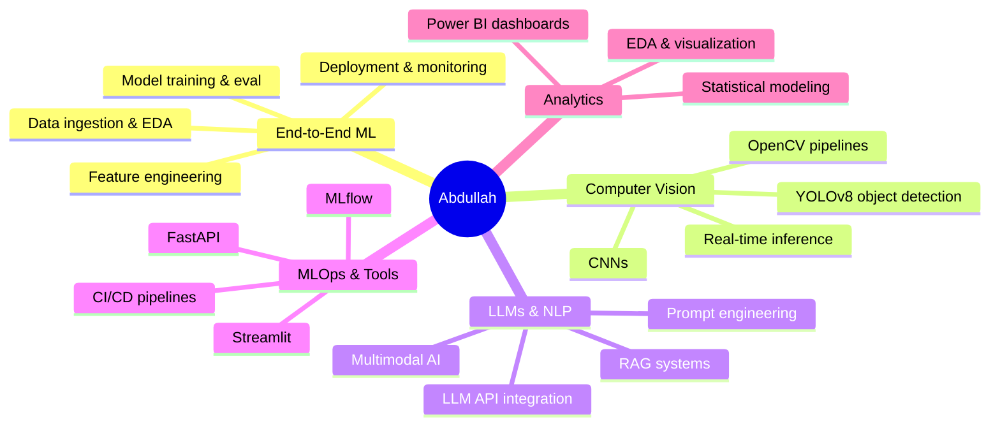
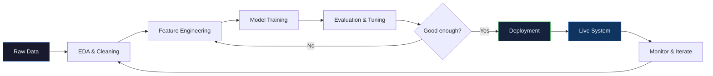

<!-- Header -->
<div align="center">
  
</div>

<div align="center">
  <a href="https://www.linkedin.com/in/abdullah-mir-211658230/">
    
  </a>
  <a href="mailto:mir.abdullah.701@gmail.com">
    
  </a>
  <a href="https://github.com/MirAb-77">
    
  </a>
  
</div>

<br/>

---

## 🧠 Who I Am

```python
class Abdullah:
    name       = "Abdullah Imran"
    role       = "Data Scientist & AI/ML Engineer"
    location   = "Lahore, Pakistan 🇵🇰"
    education  = "BS Data Science @ UMT (3.76 GPA) — Dean's Merit ×3"
    mantra     = "Most ML models never leave a notebook. Mine do."

    deployed_systems = [
        "MalVision AI   → 98% accuracy malware detection",
        "VITA           → Multimodal clinical AI (LLMs + RAG + CV)",
        "Cheatify AI    → Real-time proctoring at 45ms latency",
        "IntelliFall AI → IoT fall detection, 97% recall",
        "FraudShield AI → Explainable fraud pipeline, 89% accuracy",
        "QuickByte AI   → Full-stack LLM nutrition assistant",
    ]

    currently_building = "Cursor-like AI coding assistant (VS Code extension)"
    open_to            = "AI/ML & Software Engineering roles in Lahore"
```

---

## ⚡ What I Bring

<div align="center">



</div>

---

## 🚀 Featured Projects

<table>
<tr>
<td width="50%" valign="top">

### 🛡️ MalVision AI
**Malware Intelligence Platform**

Converts PE executable binaries into visual representations, then runs CNN-based classification across 10 malware families.

- **98% accuracy** on PE file detection
- **88% F1 score** on image-based detection
- Stack: `Python` `TensorFlow` `Keras` `OpenCV` `Streamlit`

[](https://malvision99.streamlit.app/)

</td>
<td width="50%" valign="top">

### 🏥 VITA — Clinical AI Assistant
**Multimodal Decision Support**

Combines computer vision, LLMs, and RAG for real-time symptom analysis and medical information retrieval. Evaluated on 25 sample cases.

- Full multimodal pipeline: image + text + knowledge base
- Stack: `Python` `LLMs` `RAG` `Computer Vision` `Streamlit`

[](https://github.com/MirAb-77/AI-Doctor-2.0)

</td>
</tr>
<tr>
<td width="50%" valign="top">

### 👁️ Cheatify AI
**Real-Time Exam Proctoring**

YOLOv8-based proctoring engine detecting suspicious behaviour in real time.

- **45ms** inference latency
- Stack: `Python` `YOLOv8` `OpenCV` `JavaScript` `Netlify`

[](https://cheatifyexam.netlify.app/)

</td>
<td width="50%" valign="top">

### 🚨 IntelliFall AI
**Smart Fall Detection & Emergency Response**

IoT-integrated real-time fall detection for elderly care with automated emergency alerts.

- **97% recall · 96% precision**
- Stack: `Python` `YOLOv8` `OpenCV` `IoT`

[](https://github.com/MirAb-77/IntelliFall-Real-Time-Human-Fall-Detection-Using-Computer-Vision)

</td>
</tr>
<tr>
<td width="50%" valign="top">

### 💳 FraudShield AI
**Real-Time Financial Fraud Detection**

Explainable fraud detection pipeline surfaced via interactive Power BI dashboards.

- **89% accuracy** on real-world-like dataset
- Stack: `Python` `XGBoost` `scikit-learn` `Power BI`

[](https://github.com/MirAb-77/Credit-Card-Fraud)

</td>
<td width="50%" valign="top">

### 🥗 QuickByte AI
**Personalized Nutrition Intelligence**

Full-stack LLM-powered nutrition assistant generating personalized meal plans via prompt-engineered API calls.

- Live and usable by real users daily
- Stack: `JavaScript` `LLM APIs` `Netlify` `Prompt Engineering`

[](https://zesty-crepe-1f434a.netlify.app/)

</td>
</tr>
</table>

---

## 🛠️ Tech Stack

<div align="center">

**Core ML & AI**


**Deployment & Tools**


**Analytics & Visualization**


</div>

---

## 📊 GitHub Stats

<div align="center">
  
  
</div>

<div align="center">
  
</div>

---

## 🏆 Certifications

```
IBM  ──────────────  Generative AI Engineering with LLMs
IBM  ──────────────  Data Science Professional Certificate
DeepLearning.AI  ──  Deep Learning Specialization
DataCamp  ─────────  AI Engineer for Data Scientists
DataCamp  ─────────  Certified Data Scientist
Microsoft  ────────  Power BI Data Analyst
Google  ───────────  Advanced Data Analytics
```

---

## 📈 ML Pipeline — How I Work



---

## 🌱 Currently

-  Building a **Cursor-like AI coding assistant** — VS Code extension backed by FastAPI + Gemini/Groq/OpenRouter
-  Actively open to **AI/ML & Software Engineering roles** in Lahore
-  Going deep on **production ML system design** and **LLM agent architectures**

---

<div align="center">
  
</div>

<div align="center">
  <b>mir.abdullah.701@gmail.com</b> · Lahore, Pakistan
</div>
