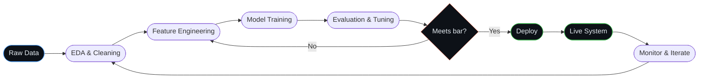
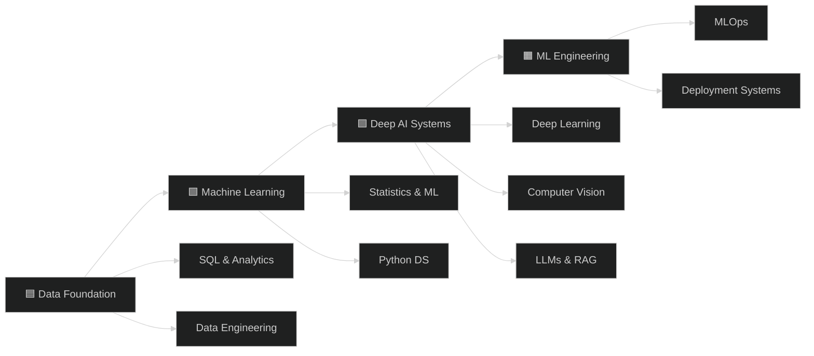
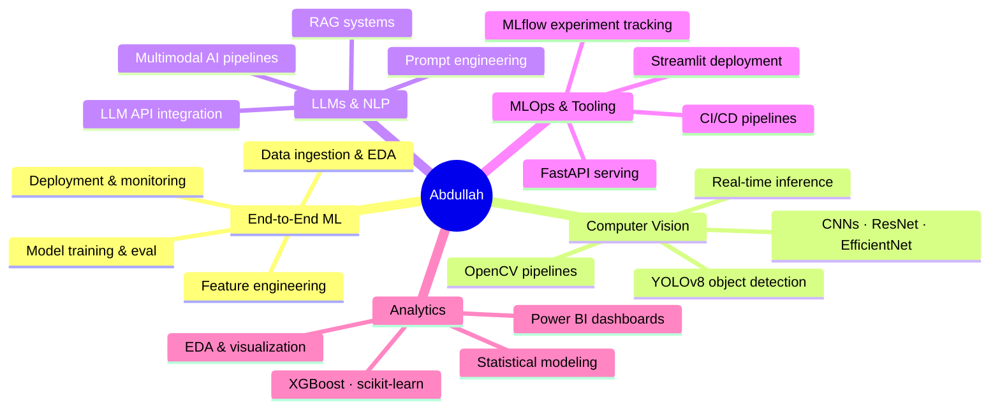

<!-- HEADER BANNER -->
<div align="center">
  
</div>

<!-- BADGES (Monochrome Style) -->
<div align="center">
  <a href="https://www.linkedin.com/in/abdullah-mir-211658230/">
    
  </a>

  <a href="mailto:mir.abdullah.701@gmail.com">
    
  </a>

  <a href="https://github.com/MirAb-77">
    
  </a>

  
</div>

<br/>

---

## ◈ &nbsp;Identity

```python
class Abdullah:
    name = "Abdullah Imran"
    role = "Data Scientist & AI/ML Engineer"
    location = "Lahore, Pakistan"
    education = "BS Data Science @ UMT — CGPA 3.76 · Dean's Merit ×3"

    experience = "AI/ML Fellow @ UET × DevSinc (30% pipeline speedup)"

    shipped_systems = 6

    projects = [
        "MalVision AI — malware detection system (98% accuracy)",
        "VITA — multimodal clinical RAG assistant",
        "Cheatify AI — real-time YOLOv8 proctoring (45ms latency)",
        "IntelliFall AI — IoT fall detection (97% recall)",
        "FraudShield AI — explainable fraud pipeline (89% accuracy)",
        "QuickByte AI — deployed LLM nutrition app",
    ]

    currently_building = "Cursor-like AI coding assistant (VS Code extension)"
    open_to = "AI/ML & Software Engineering roles"
    mindset = "Models should ship, not sit in notebooks"
```

---

## ⬡ &nbsp;Stats at a glance

<div align="center">

| ⬡ 6 Live Systems | Certififed Data Scientist | ◇ 3.76 GPA | Motivated to Lean and Grow 
|:---:|:---:|:---:|:---:|

</div>

---

## ⬠ &nbsp;ML Pipeline — How I work



## ⬟ &nbsp; Skill radar





## ⬟ &nbsp;What I bring



---

## ◇ &nbsp;Featured projects

<table>
<tr>
<td width="50%" valign="top">

### ⬡ &nbsp;MalVision AI &nbsp;—&nbsp; Malware Intelligence Platform

CNN pipeline converting PE executable binaries into image representations for automated malware classification across 10 families.

- **98% accuracy** on PE file detection
- **88% F1 score** on image-based detection
- `Python` `TensorFlow` `Keras` `OpenCV` `Streamlit`

[](https://malvision99.streamlit.app/)

</td>
<td width="50%" valign="top">

### ◈ &nbsp;VITA &nbsp;—&nbsp; Multimodal Clinical AI

Combines LLMs, RAG, and computer vision for real-time symptom analysis and medical information retrieval. Evaluated on 25 sample cases.

- Full multimodal pipeline: image + text + knowledge base
- `Python` `LLMs` `RAG` `Computer Vision` `Streamlit`

[](https://github.com/MirAb-77/AI-Doctor-2.0)

</td>
</tr>
<tr>
<td width="50%" valign="top">

### ◎ &nbsp;Cheatify AI &nbsp;—&nbsp; Real-Time Proctoring

YOLOv8-based proctoring engine detecting suspicious behaviour during online exams with production-grade latency.

- **45ms** inference latency
- `Python` `YOLOv8` `OpenCV` `JavaScript` `Netlify`

[](https://cheatifyexam.netlify.app/)

</td>
<td width="50%" valign="top">

### ⬟ &nbsp;IntelliFall AI &nbsp;—&nbsp; Smart Fall Detection

IoT-integrated real-time fall detection for elderly care with automated emergency response triggering.

- **97% recall · 96% precision**
- `Python` `YOLOv8` `OpenCV` `IoT`

[](https://github.com/MirAb-77/IntelliFall-Real-Time-Human-Fall-Detection-Using-Computer-Vision)

</td>
</tr>
<tr>
<td width="50%" valign="top">

### ⬠ &nbsp;FraudShield AI &nbsp;—&nbsp; Fraud Detection

Explainable fraud detection pipeline with feature importance surfaced via interactive Power BI dashboards.

- **89% accuracy** on real-world-like dataset
- `Python` `XGBoost` `scikit-learn` `Power BI`

[](https://github.com/MirAb-77/Credit-Card-Fraud)

</td>
<td width="50%" valign="top">

### ◇ &nbsp;QuickByte AI &nbsp;—&nbsp; Nutrition Intelligence

Full-stack LLM-powered assistant generating personalised meal plans via prompt-engineered API calls — live and in daily use.

- Real users · fully deployed
- `JavaScript` `LLM APIs` `Netlify` `Prompt Engineering`

[](https://zesty-crepe-1f434a.netlify.app/)

</td>
</tr>
</table>

---

## ◈ &nbsp;Tech stack

<div align="center">

**Core ML & AI**


**Deployment & Engineering**


**Analytics & Visualisation**


</div>

---

## ⬡ &nbsp;GitHub stats

<div align="center">
  
  
</div>

<div align="center">
  
</div>

---

## ⬟ &nbsp;Certifications

```
⬡  IBM  ────────────────────  Generative AI Engineering with LLMs
⬡  IBM  ────────────────────  Data Science Professional Certificate
◈  DeepLearning.AI  ────────  Deep Learning Specialization
◎  DataCamp  ───────────────  AI Engineer for Data Scientists
◎  DataCamp  ───────────────  Certified Data Scientist
⬠  Microsoft  ──────────────  Power BI Data Analyst
◇  Google  ─────────────────  Advanced Data Analytics
```

---

## ◎ &nbsp;Currently

> **⬡ Building:** Cursor-like AI coding assistant — VS Code extension backed by FastAPI + Gemini / Groq / OpenRouter
>
> **◈ Open to:** AI/ML & Software Engineering roles in Lahore
>
> **◇ Going deep on:** Production ML system design · LLM agent architectures · VS Code extension APIs

---

<!-- FOOTER BANNER -->
<div align="center">
  
</div>

<div align="center">
  <b>mir.abdullah.701@gmail.com</b> &nbsp;·&nbsp; Lahore, Pakistan &nbsp;·&nbsp;
  <a href="https://github.com/MirAb-77">github.com/MirAb-77</a>
</div>
